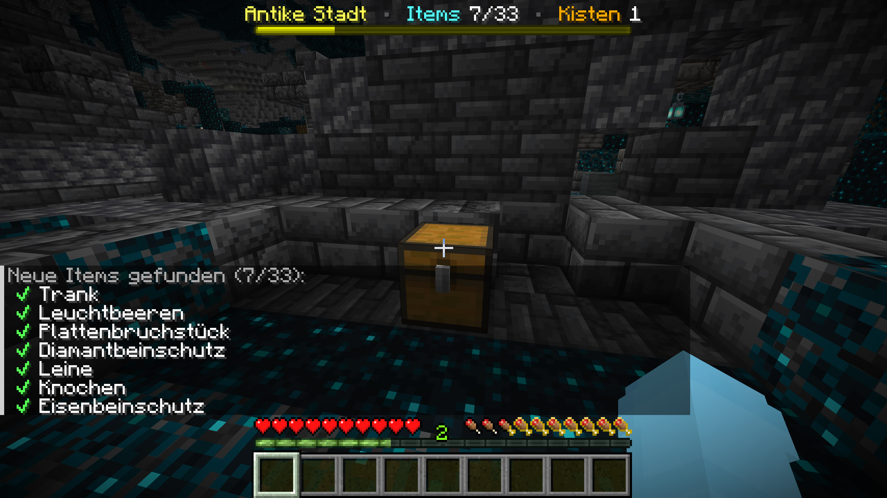
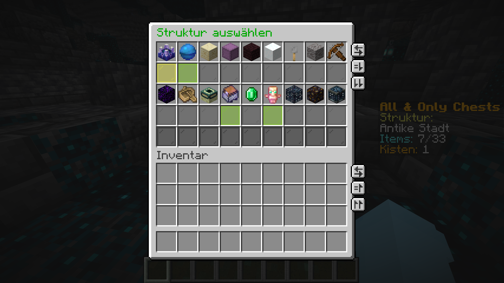
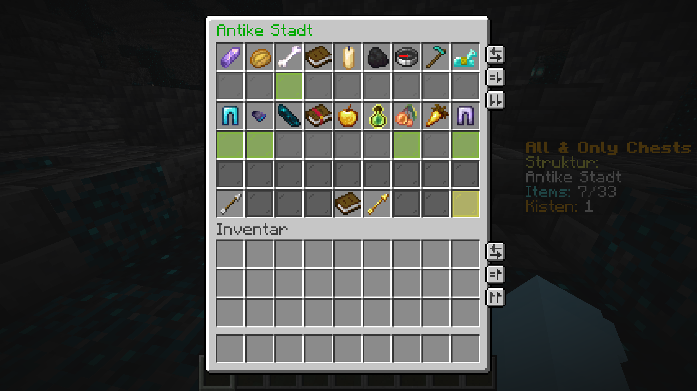
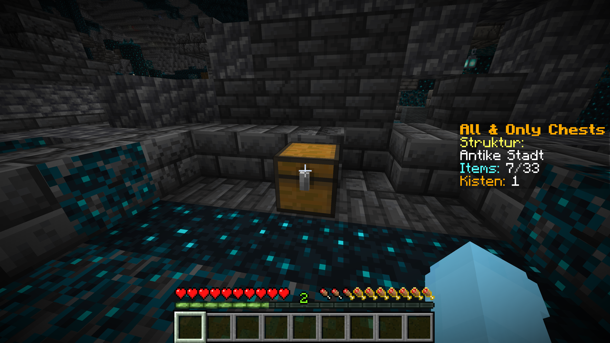
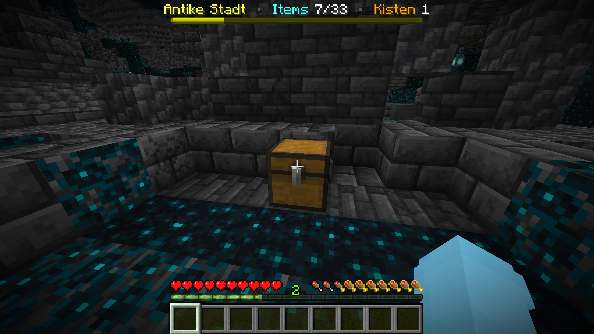
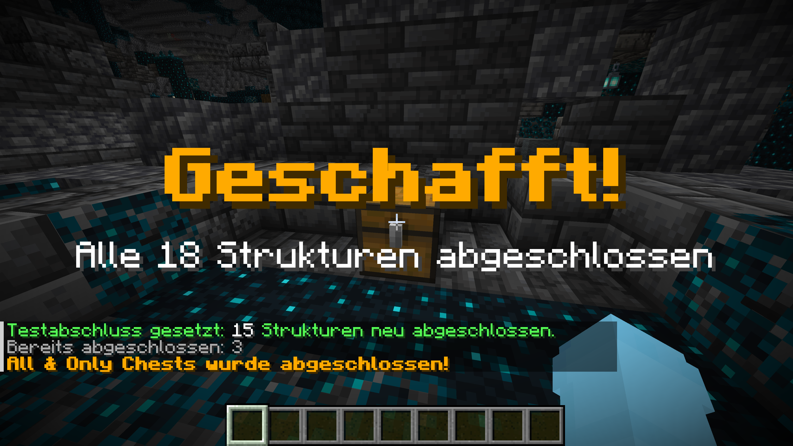

<div align="center">

# All & Only Chests

### Eine Hardcore-Loot-Challenge für Minecraft Java

<p>
  <a href="#kompatibilität"></a>&nbsp;&nbsp;<a href="https://papermc.io/"></a>&nbsp;&nbsp;<a href="#voraussetzungen"></a>&nbsp;&nbsp;<a href="#kompatibilität"></a>&nbsp;&nbsp;<a href="#lizenz"></a>
</p>

**Finde jeden möglichen Gegenstand aus den Truhen von 18 Strukturen –<br>
aber erhalte sonst nirgendwo Loot. Und du hast nur ein Leben.**

</div>



> [!IMPORTANT]
> Das Plugin befindet sich noch in der Beta-Phase. Vor einem Update oder
> längeren Durchlauf solltest du immer Welt und Plugin-Daten gemeinsam sichern.

## Was ist All & Only Chests?

All & Only Chests ist eine Minecraft-Challenge, die durch BastiGHG bekannt
geworden ist. Das Ziel klingt zunächst einfach:

1. Wähle eine Struktur aus.
2. Öffne ihre natürlich generierten Loot-Quellen.
3. Finde jeden Gegenstand, der dort laut Vanilla-Loot-Tabelle vorkommen kann.
4. Schließe alle 18 Strukturen ab.

Der Haken: Natürlich generierte Blöcke, gewöhnliche Kreaturen, Angeln und
andere Umwege liefern keinen nutzbaren Loot. Gegenstände kommen im
Wesentlichen nur aus den erlaubten Strukturquellen. Selbst platzierte Blöcke
und Container funktionieren weiterhin normal, damit die Challenge dauerhaft
spielbar bleibt.

Das Plugin orientiert sich am öffentlich verfügbaren
[Original-Plugin von Skippaddin](https://github.com/Skippaddin/All-and-Only-Chests),
wurde für aktuelle Minecraft-Versionen jedoch eigenständig neu umgesetzt.

## Die wichtigsten Regeln

- Es kann immer nur **eine Struktur gleichzeitig** aktiv sein.
- Nur Loot-Quellen der aktiven Struktur dürfen geöffnet werden.
- Bereits geöffnete Quellen zählen beim erneuten Öffnen nicht doppelt.
- Alle unterschiedlichen Zielgegenstände werden dauerhaft gespeichert.
- Natürlich generierte Blöcke und geschützte Container erzeugen beim Abbau
  keinen Loot.
- Selbst platzierte Blöcke, Container, Bilderrahmen und vergleichbare Objekte
  funktionieren nach Vanilla-Regeln.
- Gewöhnliche Kreaturen geben weiterhin Erfahrung, aber keine Gegenstände.
- Enderperlen von Endermen und Lohenruten von Lohen bleiben als notwendige
  Ausnahmen erhalten.
- Prüfungskammer-Tresore und Prüfungs-Spawner zählen als gültige Loot-Quellen.
- Die Challenge ist gewonnen, sobald alle **18 Strukturen** abgeschlossen sind.

> [!TIP]
> Endertruhen dürfen als persönlicher Speicher verwendet werden. Ihr Inhalt
> erzeugt keinen zusätzlichen Strukturfortschritt.

## Enthaltene Strukturen

| Oberwelt           | Nether & Ende | Besondere Kategorien  |
| ------------------ | ------------- | --------------------- |
| Antike Stadt       | Bastionsruine | Prüfungskammern       |
| Vergrabener Schatz | Netherfestung | Dorf                  |
| Wüstenpyramide     | Endsiedlung   | Verlies               |
| Iglu               | Ruinenportal  | Minenstollen          |
| Dschungelpyramide  |               | Plünderer-Außenposten |
| Ozeanruine         |               | Festung               |
| Schiffswrack       |               | Waldanwesen           |

## Voraussetzungen

- Minecraft Java **26.1.2** oder **26.2**
- ein [Paper-Server](https://papermc.io/downloads/paper/)
- **Java 25**
- das Plugin-JAR aus den
  [GitHub Releases](https://github.com/kisimediaDE/mc-all-and-only-chest/releases)

Vanilla, Fabric, Forge, NeoForge und Spigot werden nicht als Serverplattform
unterstützt. Client-Mods sind grundsätzlich möglich, solange sie keine
Serverregeln oder Loot-Mechaniken verändern.

## Installation

### 1. Paper vorbereiten

Richte einen Paper-Server für Minecraft 26.1.2 oder 26.2 ein und starte ihn
einmal. Akzeptiere anschließend die Minecraft-EULA in `eula.txt`.

Für die vorgesehene Hardcore-Spielweise setzt du zusätzlich in
`server.properties`:

```properties
hardcore=true
```

Das Plugin funktioniert technisch auch ohne Hardcore-Modus; dann wird ein Tod
jedoch nicht automatisch zum Ende des Durchlaufs.

### 2. Plugin installieren

1. Stoppe den Server vollständig.
2. Lade unter
   [Releases](https://github.com/kisimediaDE/mc-all-and-only-chest/releases)
   das JAR `AllAndOnlyChests-<Version>.jar` herunter.
3. Kopiere das JAR in den Ordner `plugins`.
4. Starte den Server wieder.
5. Prüfe in der Konsole, ob `AllAndOnlyChests enabled` erscheint.
6. Verbinde dich und öffne mit `/gui` die Strukturauswahl.

Der erste Start erstellt automatisch:

```text
plugins/
└── AllAndOnlyChests/
    └── data/
        └── challenge.db
```

Es muss keine Konfigurationsdatei von Hand angelegt werden.

### Hinweise für macOS und Linux

Der Server wird wie ein gewöhnlicher Paper-Server gestartet:

```bash
java -Xms2G -Xmx2G -jar paper.jar --nogui
```

Falls mehrere Java-Versionen installiert sind, kontrolliere vorher:

```bash
java -version
```

### Hinweise für Windows

Öffne PowerShell oder die Eingabeaufforderung im Serverordner und starte Paper
beispielsweise mit:

```bat
java -Xms2G -Xmx2G -jar paper.jar --nogui
```

Auch hier muss `java -version` Java 25 anzeigen. Das Plugin enthält den
benötigten SQLite-Treiber direkt im JAR; es ist keine separate
Datenbankinstallation vorgesehen.

> [!NOTE]
> macOS wurde vollständig getestet. Ein abschließender realer Windows-Test
> steht für die Beta noch aus.

## Spielen

### Struktur auswählen

Öffne `/gui` und klicke eine noch offene Struktur an. Die aktuell gewählte
Struktur wird gelb hervorgehoben, abgeschlossene Strukturen erscheinen grün.
Ein erneuter Klick öffnet die Detailansicht mit allen gesuchten Gegenständen.



### Fortschritt verfolgen

Beim Öffnen einer gültigen Quelle meldet der Chat neu gefundene Ziele. Bereits
gefundene Gegenstände werden in der Detailansicht grün markiert.



Standardmäßig zeigt eine Sidebar aktive Struktur, Itemfortschritt und die
Anzahl eindeutig besuchter Quellen. Alternativ steht eine kompakte BossBar zur
Verfügung:

```text
/chesthud sidebar
/chesthud bossbar
/chesthud off
```

`/chesthud` ohne Argument wechselt der Reihe nach zwischen den drei Varianten.

<table>
  <tr>
    <td width="50%">
      
    </td>
    <td width="50%">
      
    </td>
  </tr>
  <tr>
    <td align="center"><strong>Sidebar</strong></td>
    <td align="center"><strong>BossBar</strong></td>
  </tr>
</table>

### Struktur und Challenge abschließen

Sobald alle Ziele einer Struktur gefunden wurden, wird sie automatisch
abgeschlossen und die nächste Struktur kann ausgewählt werden. Nach der
letzten der 18 Kategorien folgt die Gesamtsieg-Anzeige.



## Befehle

### Für alle Spieler

| Befehl              | Funktion                                                                       |
| ------------------- | ------------------------------------------------------------------------------ |
| `/gui`              | Öffnet Auswahl und Detailansichten der 18 Strukturen.                          |
| `/structures`       | Zeigt Gesamtfortschritt, aktive, abgeschlossene und offene Strukturen im Chat. |
| `/chesthud`         | Wechselt zwischen Sidebar, BossBar und ausgeblendeter Anzeige.                 |
| `/chesthud sidebar` | Zeigt den Fortschritt rechts als Sidebar.                                      |
| `/chesthud bossbar` | Zeigt den Fortschritt kompakt am oberen Bildschirmrand.                        |
| `/chesthud off`     | Blendet das Challenge-HUD aus.                                                 |

### Für Administratoren

Diese Befehle sind standardmäßig nur für Operatoren freigegeben:

| Befehl                                | Funktion                                                                                |
| ------------------------------------- | --------------------------------------------------------------------------------------- |
| `/structurecomplete <Kategorie>`      | Schließt eine Kategorie kontrolliert ab.                                                |
| `/structurecomplete all`              | Schließt alle noch offenen Kategorien ab. Nur für Tests empfohlen.                      |
| `/structurereset <Kategorie> confirm` | Setzt genau eine Kategorie inklusive Ziele und Quellenzähler zurück.                    |
| `/reset confirm`                      | Löscht den gesamten Plugin-Fortschritt und alle Markierungen selbst platzierter Blöcke. |

`/reset` und `/structurereset` verändern oder löschen **keine Weltdateien**.

<details>
<summary><strong>Gültige Kategorie-IDs für Admin-Befehle anzeigen</strong></summary>

| Anzeige               | Kategorie-ID       |
| --------------------- | ------------------ |
| Antike Stadt          | `ancient_city`     |
| Vergrabener Schatz    | `buried_treasure`  |
| Wüstenpyramide        | `desert_pyramid`   |
| Endsiedlung           | `end_city`         |
| Netherfestung         | `nether_bridge`    |
| Iglu                  | `igloo`            |
| Dschungelpyramide     | `jungle_temple`    |
| Ozeanruine            | `underwater_ruin`  |
| Plünderer-Außenposten | `pillager_outpost` |
| Ruinenportal          | `ruined_portal`    |
| Schiffswrack          | `shipwreck`        |
| Festung               | `stronghold`       |
| Minenstollen          | `mineshaft`        |
| Dorf                  | `village`          |
| Waldanwesen           | `woodland_mansion` |
| Verlies               | `simple_dungeon`   |
| Bastionsruine         | `bastion`          |
| Prüfungskammern       | `trial_chambers`   |

</details>

## Was passiert nach einem Hardcore-Tod?

Ein Tod beendet den aktuellen Durchlauf. Das Plugin löscht die Welt absichtlich
nicht selbst.

Für einen vollständig neuen Versuch:

1. Stoppe den Server.
2. Sichere den alten Durchlauf, falls du ihn behalten möchtest.
3. Lösche oder verschiebe die zu `level-name` gehörenden Weltordner, gewöhnlich
   `world`, `world_nether` und `world_the_end`.
4. Starte den Server, damit Paper neue Welten erzeugt.
5. Führe als Operator `/reset confirm` aus. In der Serverkonsole wird der
   Befehl ohne führenden Schrägstrich eingegeben: `reset confirm`.

> [!WARNING]
> `/reset confirm` ist nicht rückgängig zu machen. Er löscht zwar keine Welt,
> aber den gesamten Challenge-Fortschritt und die Erkennung zuvor platzierter
> Blöcke.

## Backups und Wiederherstellung

Der komplette Plugin-Zustand liegt in:

```text
plugins/AllAndOnlyChests/data/challenge.db
```

Die SQLite-Datei enthält sowohl den Challenge-Fortschritt als auch die
Positionen selbst platzierter Blöcke.

### Sicheres Backup

1. Stoppe den Server vollständig.
2. Sichere die Weltordner.
3. Sichere zusätzlich den gesamten Ordner `plugins/AllAndOnlyChests`.

Welt und Plugin-Daten sollten immer **gemeinsam** gesichert werden, weil
platzierte Blockpositionen an die jeweilige Welt gebunden sind.

### Backup wiederherstellen

1. Stoppe den Server.
2. Stelle die zusammengehörigen Weltordner wieder her.
3. Stelle `plugins/AllAndOnlyChests` aus demselben Backup wieder her.
4. Starte den Server und kontrolliere `/structures`.

Kopiere eine laufend verwendete `challenge.db` nicht einzeln, während Paper
noch aktiv ist. SQLite kann zu diesem Zeitpunkt zusätzliche temporäre
Journaldateien verwenden.

## `structure-goals.yml`

Die Datei `structure-goals.yml` ist im Plugin-JAR enthalten. Sie beschreibt,
welche Vanilla-Gegenstände pro Struktur als Ziele gelten. Beim Start entfernt
das Plugin automatisch Ziele, die in der laufenden Minecraft-Version noch
nicht existieren. Deshalb besitzt der Minenstollen unter 26.1.2 beispielsweise
21 und unter 26.2 22 Ziele.

Die Datei ist **keine normale Serverkonfiguration** und sollte von
Endanwendern nicht im JAR verändert werden. Die Listen wurden gegen die
offiziellen Vanilla-Loot-Tabellen geprüft.

## Kompatibilität

| Umgebung                                     | Status                                        |
| -------------------------------------------- | --------------------------------------------- |
| Paper 26.2 + Java 25 auf macOS               | ✅ vollständig getestet                       |
| Paper 26.1.2 + Java 25 auf macOS             | ✅ Start, Gameplay und Persistenz getestet    |
| Paper 26.1.0 / 26.1.1                        | ⚠️ nicht als eigene Zielversion getestet      |
| Paper 26.2 + Java 25 auf Windows x64         | ✅ Build, Start und SQLite geprüft            |
| Spigot / Vanilla / Fabric / Forge / NeoForge | ❌ nicht unterstützt                          |

Ein einziges Plugin-JAR unterstützt Paper 26.1.2 und 26.2. Ziele, die erst in
26.2 verfügbar sind, werden auf 26.1.2 automatisch übersprungen.

## Lizenz

All & Only Chests steht unter der
[Zero-Clause BSD License](LICENSE) (`0BSD`). Du darfst das Plugin für private
und kommerzielle Zwecke verwenden, kopieren, verändern und weiterverbreiten.
Eine Namensnennung ist nicht vorgeschrieben.

Die Challenge-Idee wurde unter anderem durch BastiGHG bekannt. Diese
eigenständige Neuimplementierung wurde vom
[Original-Plugin von Skippaddin](https://github.com/Skippaddin/All-and-Only-Chests)
inspiriert, ist aber weder damit verbunden noch offiziell von dessen Autor
unterstützt. Für das Original gelten dessen eigene Lizenzbedingungen.

## Fehler melden

Bitte gib bei einem Fehler möglichst Folgendes an:

- exakte Minecraft- und Paper-Version,
- Ausgabe von `java -version`,
- relevante Server-Konsolenmeldungen,
- aktive Struktur und aktueller Fortschritt,
- Schritte, mit denen sich das Problem wiederholen lässt,
- einen Screenshot, falls GUI oder HUD betroffen sind.

Teile niemals eine komplette Welt oder Datenbank öffentlich, ohne vorher zu
prüfen, welche persönlichen Daten darin enthalten sein können.

---

<div align="center">

**Viel Erfolg – und denk daran: Jede Kiste könnte die Entscheidende sein.**

</div>
